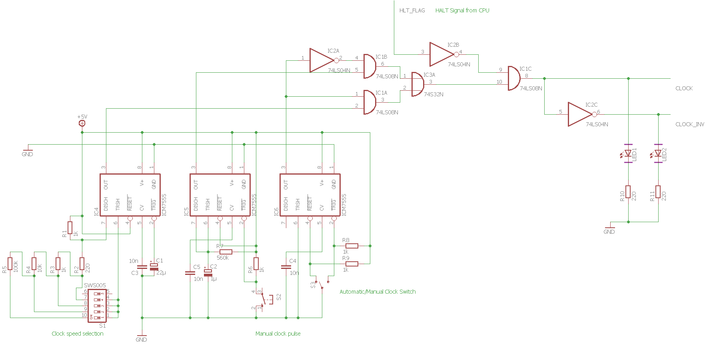

# Clock Schematics

The clock features a customizable clock rate between around 0.25Hz and 45Hz at the moment. The range of available frequencies is due to change in future iterations.

I don't see any reason why this architecture shouldn't allow me to push the frequency of the clock up to a couple hundred kilohertz. I use EEPROMs as part of my instruction decoder, which have an address to output delay of 150ns at max. The clock period has to be at least twice as long to produce on+off pulses each longer than 150ns, which puts the frequency at a theoretical maximum of 3.33 MHz.

It uses 3 555 timer ICs:
- Astable: Customizable automatic clock
- Monostable: Debouncer for manual clock pulse push button
- Bistable: Debouncer for automatic/manual mode switch

---

_(Click for full size)_

