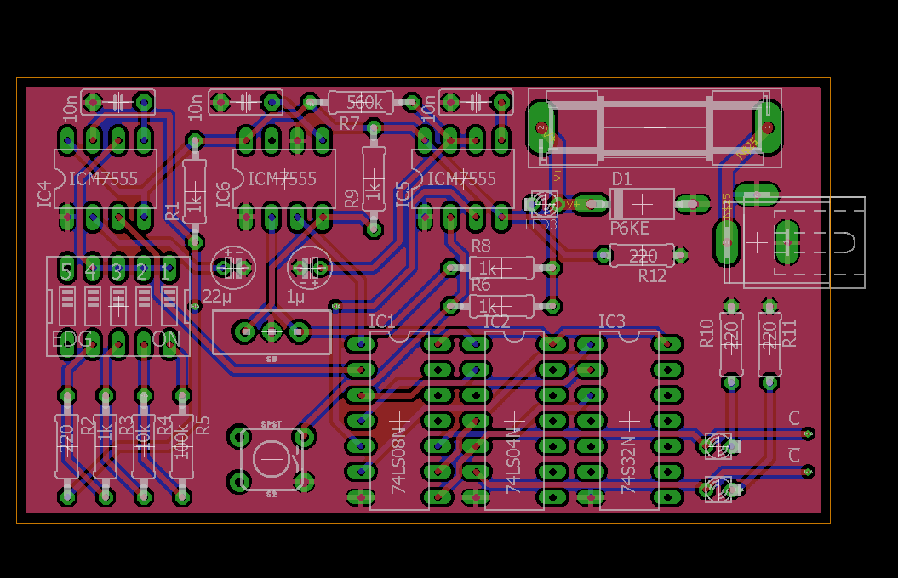

# Clock Schematics

!> For the most part I've built the parts on a breadboard first before transferring them to a more permanent perfboard. The schematics I've created afterwards. Although I've tried to be precise, I don't guarantee that there aren't any errors in them. Please let me know if you find any!

The clock features a customizable clock rate between around 0.25Hz and 45Hz at the moment. The range of available frequencies is due to change in future iterations.

I don't see any reason why this architecture shouldn't allow me to push the frequency of the clock up to a couple hundred kilohertz. The EEPROMs I use are most likely the slowest parts and put my theoretical maximum clock frequency at about 3 MHz.

The clock module also includes a DC barrel power jack for power supply and a reverse polarity protection.

---

_(Click for full size)_

## Parts
- 3x **ICM7555** [<i class="fa fa-book"></i>](http://cdn-reichelt.de/documents/datenblatt/A200/ICM7555.pdf)
- 1x **74LS04** [<i class="fa fa-book"></i>](http://cdn-reichelt.de/documents/datenblatt/A200/LS04_LS05_REN.pdf)
- 1x **74LS08** [<i class="fa fa-book"></i>](http://cdn-reichelt.de/documents/datenblatt/A200/LS08_REN.pdf)
- 1x **74LS32** [<i class="fa fa-book"></i>](http://cdn-reichelt.de/documents/datenblatt/A200/LS_32.pdf)
- 4x 220&#8486; Resistor
- 5x 1k&#8486; Resistor
- 1x 10k&#8486; Resistor
- 1x 100k&#8486; Resistor
- 1x 560k&#8486; Resistor
- 3x 1nF Capacitor
- 1x 22&micro;F Capacitor
- 1x 1&micro;F Capacitor
- 3x 3mm LEDs
- 1x DIP switch _(4 switches are sufficient, I only had 5 switch ones around)_
- 1x Push Button
- 1x SPDT slide switch
- 1x Avalanche diode
- 1x Quick-burning fuse (5A) + socket
