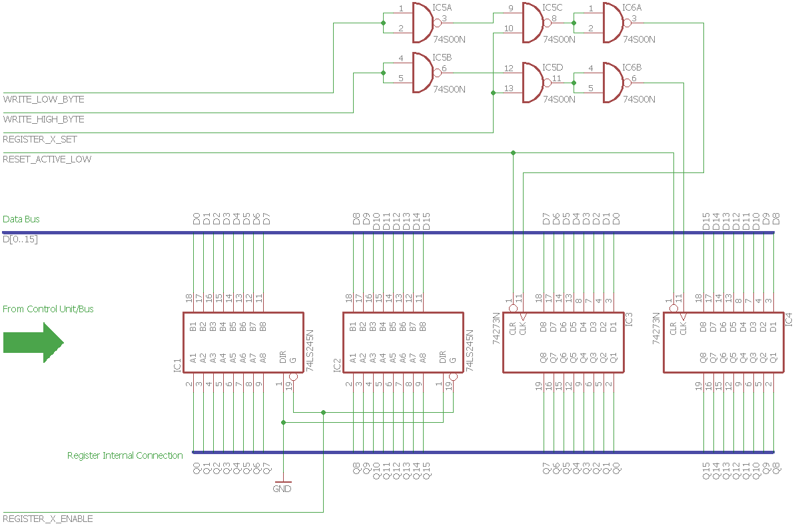

# General Purpose Registers

The PCA One includes 8 general purpose registers, the last of which is directly connected to a binary to BCD decoder and some 7 segment hexadecimal displays, just for ease of output.

Each register holds 16 bits of data, but the instructions `MVIH` and `MVIL` need to write into the high and low byte of a register respectively, so there needs to be some control over which byte to write to. That's what the `WRITE_LOW_BYTE` and `WRITE_HIGH_BYTE` control signals are for. They are both active low and bringing one of them to high disables writing to the respective byte.

Since there can always only be one register being written to, these control signals are connected to all registers. The `REGISTER_X_SET` line is a demultiplexed signal that's unique to each register and selects the appropriate one.

---

_(Click for full size)_

## Parts
- 2x **74LS245** [<i class="fa fa-book"></i>](http://cdn-reichelt.de/documents/datenblatt/A240/SN74LS245-Don%23ON.pdf)
- 2x **74LS273** [<i class="fa fa-book"></i>](http://cdn-reichelt.de/documents/datenblatt/A200/LS273_REN.pdf)
- 2x **74LS00** [<i class="fa fa-book"></i>](http://cdn-reichelt.de/documents/datenblatt/A200/LS00_REN.pdf)
